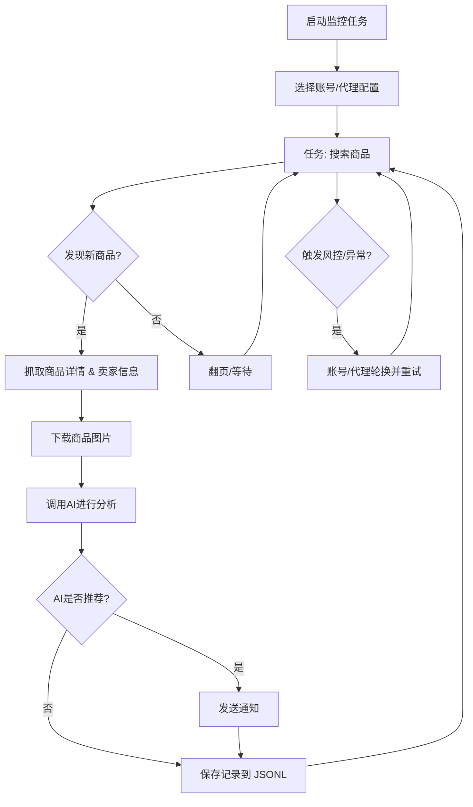

# 闲鱼智能监控机器人

基于 Playwright 和 AI 的闲鱼多任务实时监控工具，提供完整的 Web 管理界面。

## 核心特性

- **Web 可视化管理**: 任务管理、账号管理、AI 标准编辑、运行日志、结果浏览
- **AI 驱动**: 自然语言创建任务，多模态模型深度分析商品
- **多任务并发**: 独立配置关键词、价格、筛选条件和 AI Prompt
- **即时通知**: 支持 ntfy.sh、企业微信、Bark、Telegram、Webhook
- **定时调度**: Cron 表达式配置周期性任务
- **账号与代理轮换**: 多账号管理、任务绑定账号、代理池轮换与失败重试
- **Docker 部署**: 一键容器化部署

## 截图


## 快速开始

### 环境准备

**要求**:
- Python 3.10+
- Node.js + npm（用于前端构建）
- Playwright 浏览器依赖（未安装时执行 `playwright install chromium`）

```bash
git clone https://github.com/Usagi-org/ai-goofish-monitor
cd ai-goofish-monitor
```

### 配置

1. **创建配置文件**

```bash
cp .env.example .env
```

2. **核心配置项**

| 变量 | 说明 | 必填 |
|------|------|------|
| `OPENAI_API_KEY` | AI 模型 API Key | 是 |
| `OPENAI_BASE_URL` | API 接口地址（兼容 OpenAI 格式） | 是 |
| `OPENAI_MODEL_NAME` | 多模态模型名称（如 `gpt-4o`） | 是 |
| `WEB_USERNAME` / `WEB_PASSWORD` | Web 界面登录凭据（默认 `admin` / `admin123`） | 否 |
| `NTFY_TOPIC_URL` | ntfy.sh 通知地址 | 否 |
| `BARK_URL` | Bark 推送地址 | 否 |
| `WX_BOT_URL` | 企业微信 Webhook（需用双引号包围） | 否 |

完整配置项参考 `.env.example`

3. **启动服务**

```bash
chmod +x start.sh && ./start.sh
```

start.sh 会自动完成依赖安装、前端构建与后端启动。

4. **访问 Web UI**
访问 `http://127.0.0.1:8000`，
**登录默认密码(admin/admin123)** → **闲鱼账号管理**，按提示使用 [Chrome 扩展](https://chromewebstore.google.com/detail/xianyu-login-state-extrac/eidlpfjiodpigmfcahkmlenhppfklcoa) 提取并粘贴登录状态 JSON。
账号会保存到 `state/` 目录（例如 `state/acc_1.json`）。随后在**任务管理**中选择绑定账号即可开始使用。

## 🐳 Docker 部署

使用 `docker-compose.yaml` 一键启动，镜像已预置前端构建与运行环境。

### 1) 准备

```bash
cp .env.example .env
```

### 2) 启动

```bash
docker compose up -d
```

### 3) 访问与管理

- **访问 Web UI**: `http://127.0.0.1:8000`
- **查看日志**: `docker compose logs -f app`
- **停止服务**: `docker compose down`
账号状态默认保存在容器内 `/app/state`，如需持久化可在 compose 中添加挂载 `./state:/app/state`。

### 4) 更新镜像

```bash
docker compose pull
docker compose up -d
```

## Web UI 功能一览

<details>
<summary>点击展开 Web UI 功能详情</summary>

- **任务管理**：AI 创建、参数编辑、任务调度、账号绑定
- **闲鱼账号管理**：添加/更新/删除账号，导入登录状态 JSON
- **结果查看**：卡片浏览、筛选排序、详情查看
- **运行日志**：按任务分组、增量加载、自动刷新
- **系统设置**：状态检查、Prompt 编辑、代理轮换

</details>

## 🚀 工作流程

下图描述了单个监控任务从启动到完成的核心处理逻辑。在实际使用中，`src.app` 会作为主服务，根据用户操作或定时调度来启动一个或多个任务进程。



## Web 界面认证

<details>
<summary>点击展开认证配置详情</summary>

### 认证配置

Web界面已启用Basic认证保护，确保只有授权用户才能访问管理界面和API。

#### 配置方法

在 `.env` 文件中设置认证凭据：

```bash
# Web服务认证配置
WEB_USERNAME=admin
WEB_PASSWORD=admin123
```

#### 默认凭据

如果未在 `.env` 文件中设置认证凭据，系统将使用以下默认值：
- 用户名：`admin`
- 密码：`admin123`

**⚠️ 重要：生产环境请务必修改默认密码！**

#### 认证范围

- **需要认证**：所有API端点、Web界面、静态资源
- **无需认证**：健康检查端点 (`/health`)

#### 使用方法

1. **浏览器访问**：访问Web界面时会弹出认证对话框
2. **API调用**：需要在请求头中包含Basic认证信息
3. **前端JavaScript**：会自动处理认证，无需修改

#### 安全建议

1. 修改默认密码为强密码
2. 生产环境使用HTTPS协议
3. 定期更换认证凭据
4. 通过防火墙限制访问IP范围

详细配置说明请参考 [AUTH_README.md](AUTH_README.md)。

</details>


## 致谢

<details>
<summary>点击展开致谢内容</summary>

本项目在开发过程中参考了以下优秀项目，特此感谢：

- [superboyyy/xianyu_spider](https://github.com/superboyyy/xianyu_spider)

以及感谢LinuxDo相关人员的脚本贡献

- [@jooooody](https://linux.do/u/jooooody/summary)

以及感谢 [LinuxDo](https://linux.do/) 社区。

以及感谢 ClaudeCode/Gemini/Codex 等模型工具，解放双手 体验Vibe Coding的快乐。

</details>

## 体会

<details>
<summary>点击展开项目体会</summary>

本项目 90%+ 的代码都由AI生成，包括 ISSUE 中涉及的 PR 。

Vibe Coding 的可怕之处在于如果不过多的参与项目建设，对AI生成的代码没有进行细致的review，没有思考过AI为什么这么写，盲目的通过跑测试用例验证功能可用性只会导致项目变成一个黑盒。

同样再用AI对AI生成的代码进行code review时，就像是用AI来验证另一个AI的回答是不是AI，陷入了自我证明的困境之中，所以AI可以辅助分析，但不应该成为真相的仲裁者。


</details>

## 注意事项

<details>
<summary>点击展开注意事项详情</summary>

- 请遵守闲鱼的用户协议和robots.txt规则，不要进行过于频繁的请求，以免对服务器造成负担或导致账号被限制。
- 本项目仅供学习和技术研究使用，请勿用于非法用途。
- 本项目采用 [MIT 许可证](LICENSE) 发布，按"现状"提供，不提供任何形式的担保。
- 项目作者及贡献者不对因使用本软件而导致的任何直接、间接、附带或特殊的损害或损失承担责任。
- 如需了解更多详细信息，请查看 [免责声明](DISCLAIMER.md) 文件。

</details>

## Star History

[](https://www.star-history.com/#Usagi-org/ai-goofish-monitor&Date)
